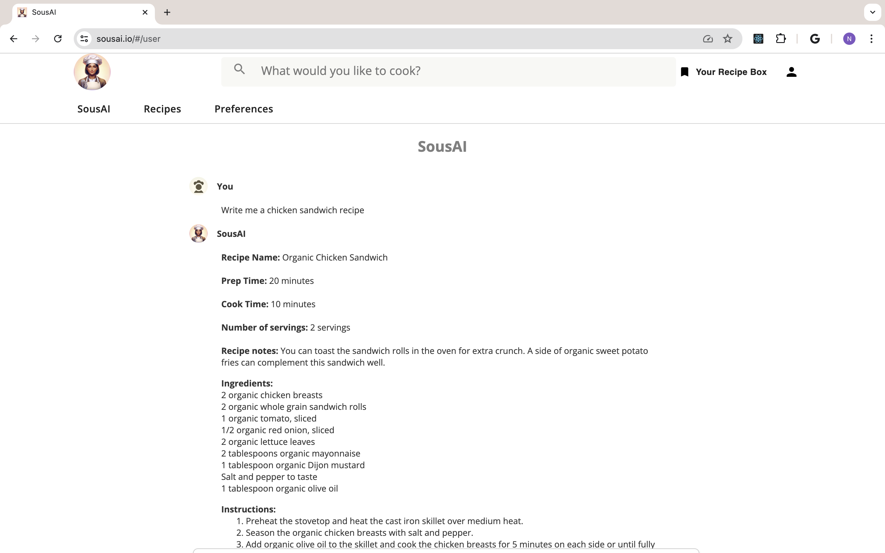
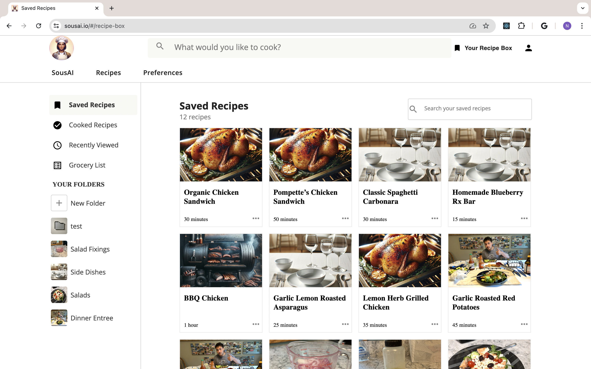
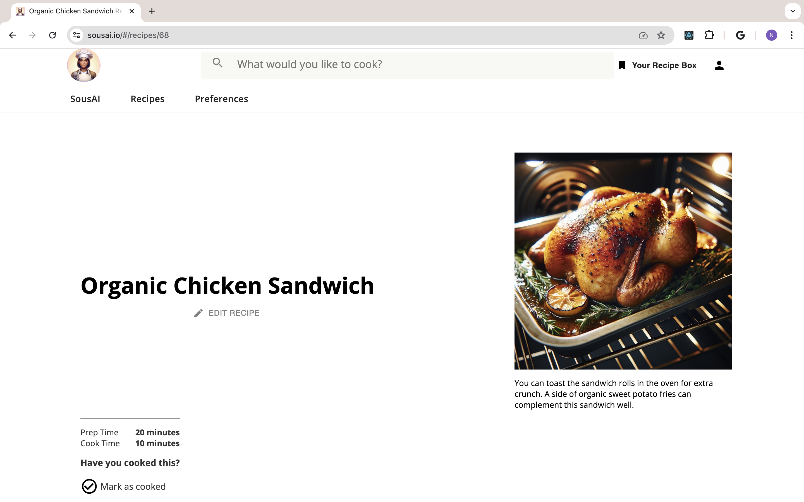

# SousAI: A Full-stack Recipes App

## Table of Contents
- [Description](#Description)
- [Installation](#Installation)
- [Usage](#Usage)
- [Screenshots](#Screenshots)
- [Built With](#Built-With)
- [Contributing](#Contributing)
- [Acknowledgments](#Acknowledgments)

## Description
SousAI is a web application that features a cutting-edge recipe-generating AI assistant and a personalized recipe box. With SousAI, users can:

- **Create Recipes:** Use Sous, the AI-powered recipe assistant, to generate unique and tailored recipes.
- **Save and Personalize:** Save your favorite recipes to your personal recipe box, where you can add notes and photos for future reference.
- **Customization:** Input your cooking devices, ingredients, and dietary preferences to receive recipes specifically tailored to your needs.

SousAI is hosted at [https://www.sousai.io/](https://www.sousai.io/) using AWS and Heroku. The app is built with React, Redux, Node.js, PostgreSQL, and OpenAI's API.

## Installation
1. Create a database named ```sous_ai```
2. Fork and clone this repository
3. The queries in the database.sql file are set up to create all necessary tables and populate the needed data to allow the app to run correctly. The project is built on PostgreSQL, so you will need to have PostgreSQL installed for the app to work. We recommend using Postico to run those queries as that was used to create the queries.
4. Open up your editor of choice and run an ```npm install```
5. Run ```npm run server``` in your terminal
6. Run ```npm run client``` in your terminal
7. The ```npm run client``` command will open up a new browser tab for you

## Usage
After starting the application:
1. Register a new account for the app
2. Navigate into the SousAI view once signed-in to the app
3. Request a recipe of your choice using the input field at the bottom of the SousAI page
4. Save a recipe that appeals to you using the button at the bottom of the recipe
5. Navigate into the 'Saved recipes' page to view your saved recipes

## Screenshots
<!-- 


 -->





## Built With
1. React.js - Frontend framework.
2. Redux - State management.
3. Node.js - Backend server.
4. Express - Server framework.
5. PostgreSQL - Database management.
6. OpenAI's API - AI recipe generation.

## Contributing
Contributions are welcome. Please follow these steps to contribute:
1. Fork the repository.
2. Create a new branch (git checkout -b feature/YourFeature).
3. Commit your changes (git commit -m 'Add some feature').
4. Push to the branch (git push origin feature/YourFeature).
5. Open a pull request.

## Acknowledgments
Thank you to Chris Black and Chris Cantoni for your contributions to the success of this project. I am also grateful to OpenAI for making their API available to build with.

